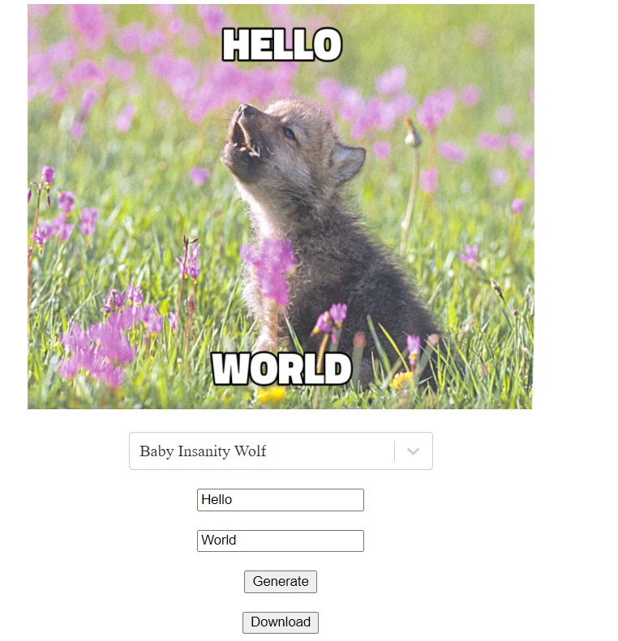

## React Meme Generator

- [Link to GitHub repo](https://github.com/anastasiia-lk/react-meme-generator.git)
- [Link to CodeSandbox](https://codesandbox.io/s/red-dream-pkfin)
- [Link to Netlify](https://objective-nobel-83354e.netlify.app/)

### Functionalities

- Creating a meme:
  - Select a meme from the select list
  - Enter the top text into the input field "Enter Top Text"
  - Enter the bottom text into the input field "Enter Bottom Text"
  - Click the button "Generate"
- Download a meme: Click the button "Download"

## How to start

Please run `yarn start` to start the application

